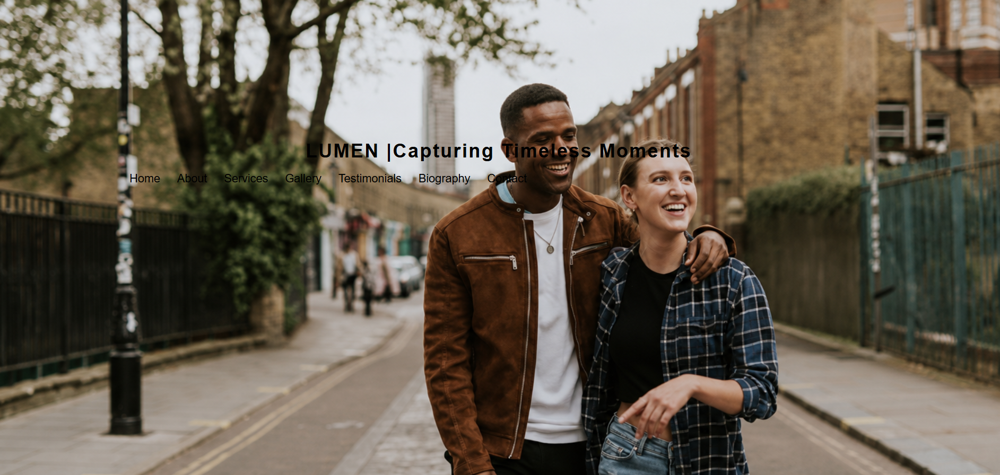
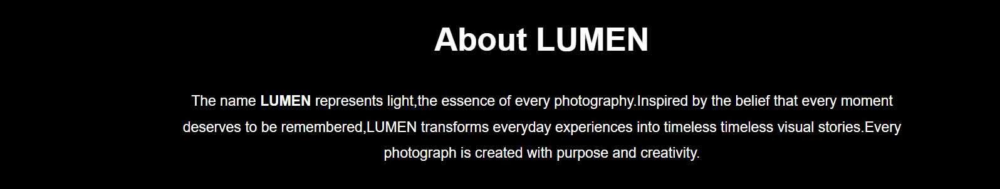
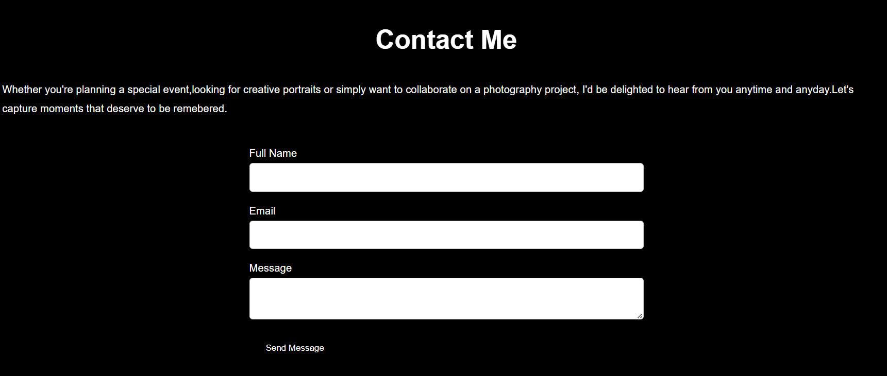

# LUMEN Photography

## Author - Martin Muriithi

## Project Description

LUMEN Photography is a responsive photography portfolio website created using   HTML and CSS.The purpose of this project is to showcase photography work in a clean,modern and visually appealing way.The website allows visitors to explore a collection of photographs,learn about the photographer,read testimonials,view services offered andget in touch through a contatc form.

The design focuses on simplicity,elegance and user experience while maintaining a professional appearance.

## FEATURES
-Responsive navigation bar
-Hero section with background image
-About section
-Biography section
-Photography gallery
-Services section
-Testimonails
-Contact form
-Footer with copyright information
-Hover effects and smooth transitions
-Responsive layout using CSS media queries

## Technologies Used
-HTML
-CSS
-Visual Studio Code
-Github

## Project structure

- Home
- Introduction section with a welcome and a call to action button.

- About Me
- Personal introduction and photography journey.

- Services
- Photography services offered.

- Gallery
- Collection of captured photographs displayed in a visual layout.

- Biography
- Story, experience and passion behind photography.

- Testimonials
- Clients reviews and feedback.

- Contact
- Contact information for inquires and booking.

- 
## Screenshots

### Homepage

### About Section

### Contact

## Installation

1. Clone the repository.
git clone git@github.com:martinmmuriithi28-28/Photography-Portfolio.git

2.Open the project folder which is cd Photography-Portfolio. 
3.Open index.html in your browser.

## Live Demo
Github Pages Link:
https://github.com/martinmmuriithi28-28/Photography-Portfolio.git

## License

This project is licensed under the MIT License.

